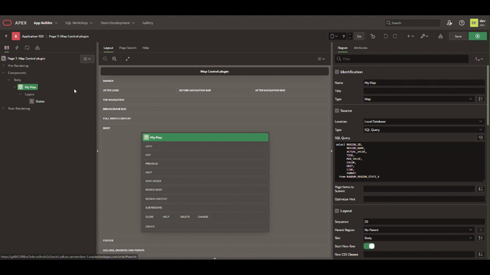

# 🗺️ Map-Control-Plugin
A custom Oracle APEX **region plugin** that allows developers to add **custom controls** to a Map Region at runtime.  
Perfect for enhancing user interaction with maps — add buttons, selectors, toggles, or any UI component directly on top of your map.

---

## ✨ Features

- ➕ Add **custom map controls** such as buttons, dropdowns, or inputs.  
- 📍 Place controls in different positions (top-left, top-right, bottom-left, bottom-right).  
- ⚡ Fully integrated with APEX map regions.  
- 🎨 Supports custom HTML, CSS, and JavaScript.  
- 🔌 Works seamlessly with existing APEX map layers and events.  

---

## 🚀 Installation

Follow these steps to add the APEX Map Control Plugin to your application:

1. **Download the plugin file**
   - Ensure you have the plugin SQL file, e.g., `Map_Control_Plugin.sql`.

2. **Import into Oracle APEX**
   - Go to your APEX application.
   - Navigate to **Shared Components > Plug-ins**.
   - Click **Import** and select `Map_Control_Plugin.sql`.
   - Click **Next** and follow the prompts to finish the import.

3. **Add a Map Control region**
   - Go to the page where your map region exists.
   - Create a **new page item** of type **Map Control** under the map.

4. **Configure your control**
   - Enter your **Control HTML** (e.g., ``).  
     You can find more icons [here](https://oracleapex.com/ords/r/apex_pm/ut/icons).
   - Choose **Control Position** (top-left, top-right, bottom-left, bottom-right).
   - Optionally add **Custom JS Action** for control behavior.

5. **Run your application**
   - Your custom control will now appear on the map region at the specified position.
   - 
---

## 🖼️ Preview

## 🧑‍💻 Author
Built with ❤️ for Oracle APEX by ABJABJA Salah-Eddine.
